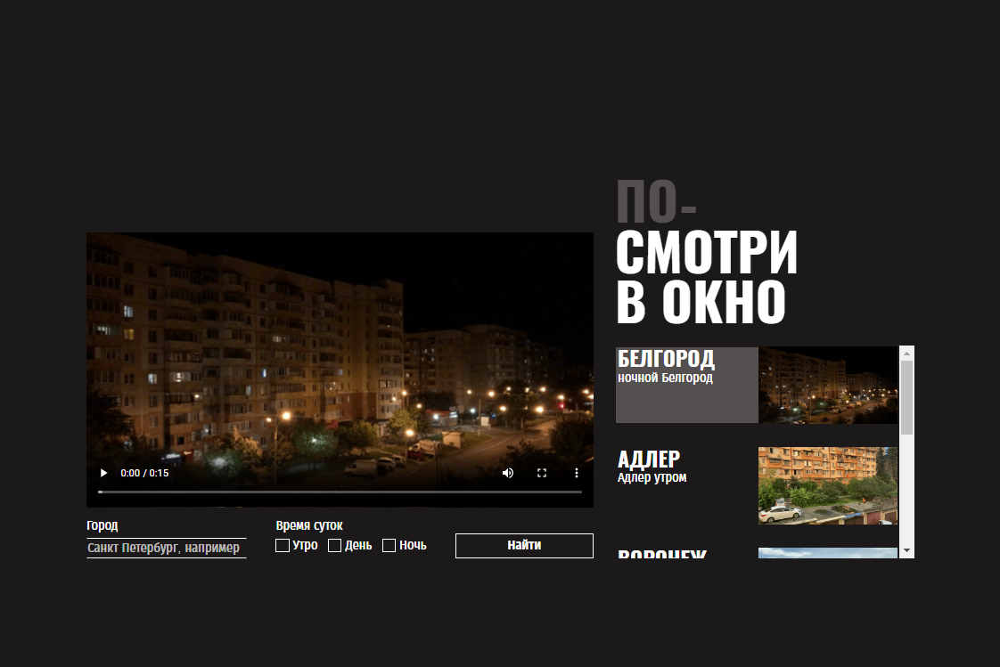

https://github.com/RiconCla/posmotri_v_okno.git
# Яндекс Практикум, проектная работа "Посмотри в окно"

## Оглавление

- [Запуск](#запуск)
- [Скриншоты](#скриншоты)
- [Описание](#описание)
- [Благодарность](#благодарность)

### Запуск

Достаточно перейти на [GitHub Pages](https://riconcla.github.io/posmotri_v_okno/)

### Скриншоты

### Описание

Проект для отработки навыка работы с встраиванием интерактивного контента(видео) и работы псевдоэлементов.

Использованные технологии: HTML, CSS, FLEX, BEM, JS.

## Благодарность

Благодарю команду Яндекс Практикум за предоставление дизайна и уроков!